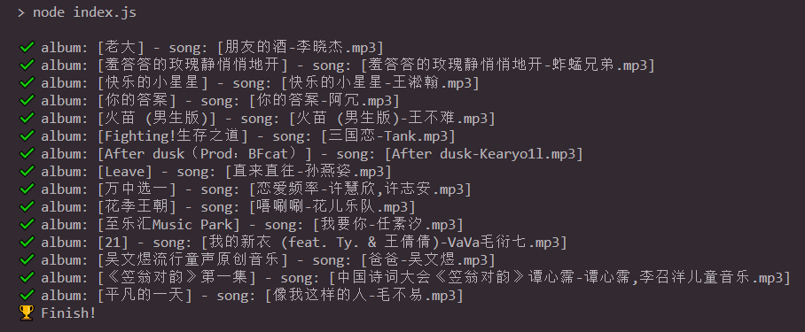
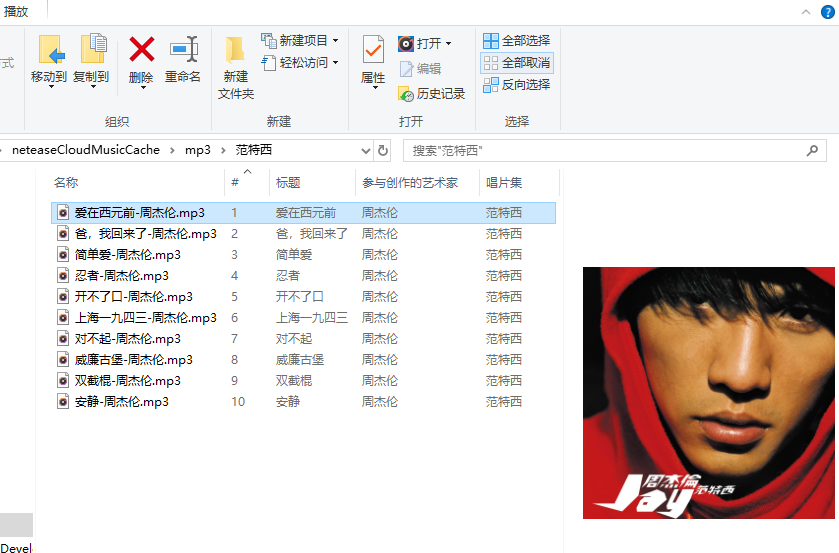

# Netease Cloud Music Cache to MP3

## 1. First at all:

Install
`网易云音乐` **and listen to some songs !!**  
Node: https://nodejs.org/en/  
Git: https://git-scm.com/downloads  
To set `网易云音乐` cache path `NETEASE_CLOUDMUSIC_PATH` in the `config.js`.

## 2. Usage:

```
# install dependencies
npm i

# run
npm start

```

## 3. Example





## Ref:

[如何从缓存白嫖网易云音乐](https://segmentfault.com/a/1190000022772403)

abc
def